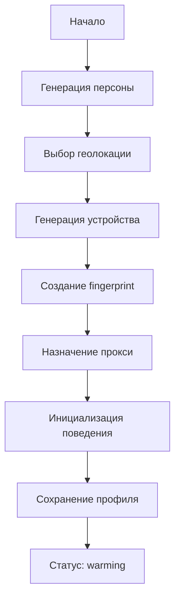
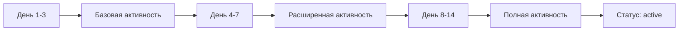

# Детальный алгоритм работы SEO-системы

## 1. Жизненный цикл профиля

### 1.1 Создание профиля



**Алгоритм генерации персоны:**
1. Возраст: нормальное распределение 25-55 лет
2. Пол: 50/50 с коррекцией по интересам
3. Интересы: 3-7 категорий из предопределенного списка
4. Доход: коррелирует с возрастом и регионом
5. Образование: влияет на поисковые запросы

**Алгоритм fingerprint:**
1. UserAgent соответствует ОС и браузеру
2. Разрешение экрана из топ-10 популярных
3. Шрифты соответствуют ОС
4. WebGL параметры варьируются в пределах 5%
5. Canvas noise добавляется уникально для каждого профиля

### 1.2 Прогрев профиля (7-14 дней)



**Прогрессия активности:**
- День 1-3: 5-10 действий/день (новости, поиск погоды)
- День 4-7: 15-25 действий/день (+ видео, карты)
- День 8-14: 30-50 действий/день (+ покупки, соцсети)

## 2. Алгоритм выполнения поисковой задачи

### 2.1 Подготовка

```python
def prepare_search_task(profile, task):
    # 1. Проверка здоровья профиля
    if profile.ban_score > 0.7:
        return defer_task(task, '24h')
    
    # 2. Выбор времени выполнения
    execution_time = calculate_natural_time(
        profile.behavior.active_hours,
        profile.timezone,
        profile.last_activity
    )
    
    # 3. Подготовка контекста
    context = {
        'proxy': select_proxy(profile.region),
        'fingerprint': profile.fingerprint,
        'cookies': profile.cookies,
        'referrer': select_referrer(task.type)
    }
    
    return context
```

### 2.2 Выполнение поиска

```python
async def execute_search(page, behavior, query, target):
    # 1. Переход на поисковик
    await natural_navigation(page, search_engine_url)
    
    # 2. Ожидание загрузки
    await human_like_wait(2000, 4000)
    
    # 3. Фокус на поисковую строку
    search_box = await find_search_input(page)
    await smooth_mouse_move(page, search_box)
    await page.click(search_box)
    
    # 4. Набор запроса
    for char in query:
        # Иногда делаем опечатки
        if random() < 0.02:
            wrong_char = get_similar_char(char)
            await type_char(page, wrong_char)
            await wait(100, 300)
            await page.keyboard.press('Backspace')
        
        await type_char(page, char)
        await wait_typing_delay()
    
    # 5. Отправка запроса
    await wait(500, 1500)  # Пауза перед отправкой
    await page.keyboard.press('Enter')
    
    # 6. Ожидание результатов
    await page.waitForNavigation()
    await wait(1000, 3000)
    
    # 7. Анализ результатов
    results = await scan_search_results(page)
    target_position = find_target_position(results, target)
    
    # 8. Навигация к цели
    if target_position:
        await navigate_to_target(page, behavior, target_position)
    else:
        await search_next_page(page, behavior, target)
```

### 2.3 Поведение на целевом сайте

```python
async def target_site_behavior(page, behavior, duration):
    start_time = time.now()
    pages_visited = 1
    
    while time.now() - start_time < duration:
        # 1. Чтение контента
        await read_content(page, behavior)
        
        # 2. Случайные действия
        action = weighted_choice([
            ('scroll', 0.4),
            ('hover', 0.2),
            ('click_link', 0.2),
            ('idle', 0.1),
            ('mouse_move', 0.1)
        ])
        
        await perform_action(page, behavior, action)
        
        # 3. Решение о переходе
        if should_navigate_further(pages_visited, duration):
            internal_links = await get_internal_links(page)
            if internal_links:
                link = select_interesting_link(internal_links, behavior)
                await click_link(page, behavior, link)
                pages_visited += 1
        
        await wait_between_actions(behavior)
```

## 3. Алгоритм человекоподобного поведения

### 3.1 Движение мыши

```python
def generate_mouse_path(start, end):
    """Генерация человекоподобной траектории мыши"""
    distance = calculate_distance(start, end)
    
    # Количество контрольных точек зависит от расстояния
    control_points = 2 + int(distance / 200)
    
    # Генерация кривой Безье
    points = []
    for i in range(control_points):
        # Отклонение от прямой линии
        deviation = gaussian(0, distance * 0.1)
        angle = random() * 2 * pi
        
        t = (i + 1) / (control_points + 1)
        base_x = lerp(start.x, end.x, t)
        base_y = lerp(start.y, end.y, t)
        
        point = Point(
            base_x + cos(angle) * deviation,
            base_y + sin(angle) * deviation
        )
        points.append(point)
    
    # Создание плавной кривой через контрольные точки
    return bezier_curve(start, points, end)
```

### 3.2 Паттерны скроллинга

```python
def human_scroll_pattern(page, direction, total_distance):
    """Человекоподобный скроллинг с паузами для чтения"""
    scrolled = 0
    
    while scrolled < total_distance:
        # Скорость скроллинга варьируется
        speed = gaussian(300, 100)  # пикселей/сек
        
        # Расстояние одного "движения колесика"
        chunk = randint(100, 300)
        
        # Скроллинг
        await smooth_scroll(page, direction, chunk, speed)
        scrolled += chunk
        
        # Паузы для чтения
        if random() < 0.3:  # 30% вероятность паузы
            read_time = calculate_read_time(chunk)
            await wait(read_time * 0.8, read_time * 1.2)
        
        # Иногда скроллим назад (перечитываем)
        if random() < 0.05:  # 5% вероятность
            await smooth_scroll(page, -direction, chunk/2, speed)
            scrolled -= chunk/2
```

### 3.3 Паттерны внимания

```python
class AttentionPattern:
    def __init__(self, profile_behavior):
        self.reading_speed = profile_behavior.reading_speed
        self.attention_span = profile_behavior.attention_span
        self.interests = profile_behavior.interests
    
    def calculate_engagement(self, content):
        """Расчет уровня вовлеченности в контент"""
        base_engagement = 0.5
        
        # Факторы, влияющие на вовлеченность
        factors = {
            'keyword_match': self.match_interests(content),
            'content_length': self.length_preference(len(content)),
            'media_presence': 0.2 if has_media(content) else 0,
            'time_of_day': self.alertness_by_time()
        }
        
        engagement = base_engagement + sum(factors.values())
        return min(1.0, max(0.1, engagement))
    
    def generate_reading_pattern(self, content, engagement):
        """Генерация паттерна чтения на основе вовлеченности"""
        words = count_words(content)
        base_time = words / self.reading_speed * 60000  # мс
        
        # Корректировка времени на основе вовлеченности
        actual_time = base_time * (0.5 + engagement)
        
        # Разбивка на сегменты чтения
        segments = []
        remaining_time = actual_time
        
        while remaining_time > 0:
            # Длительность сегмента
            segment_time = min(
                gaussian(30000, 10000),  # 30±10 сек
                remaining_time
            )
            
            # Тип активности в сегменте
            if engagement > 0.7:
                activity = 'focused_reading'
            elif engagement > 0.4:
                activity = 'scanning'
            else:
                activity = 'skimming'
            
            segments.append({
                'duration': segment_time,
                'activity': activity,
                'scroll_speed': self.get_scroll_speed(activity)
            })
            
            remaining_time -= segment_time
            
            # Снижение внимания со временем
            engagement *= 0.95
        
        return segments
```

## 4. Система обхода защит

### 4.1 Обход детекции автоматизации

```javascript
// Инъекция в контекст браузера
async function injectStealthScripts(page) {
    // 1. Скрытие webdriver
    await page.evaluateOnNewDocument(() => {
        Object.defineProperty(navigator, 'webdriver', {
            get: () => undefined
        });
    });
    
    // 2. Исправление navigator.plugins
    await page.evaluateOnNewDocument(() => {
        const pluginsData = [
            {
                name: 'Chrome PDF Plugin',
                description: 'Portable Document Format',
                filename: 'internal-pdf-viewer',
                mimeTypes: [{
                    type: 'application/pdf',
                    suffixes: 'pdf',
                    description: 'Portable Document Format'
                }]
            }
        ];
        
        Object.defineProperty(navigator, 'plugins', {
            get: () => {
                const plugins = new PluginArray();
                pluginsData.forEach(p => plugins.push(p));
                return plugins;
            }
        });
    });
    
    // 3. Runtime.enable детекция
    await page.evaluateOnNewDocument(() => {
        const originalCall = Function.prototype.call;
        Function.prototype.call = function(...args) {
            if (args[1] && args[1].includes('Runtime.enable')) {
                return undefined;
            }
            return originalCall.apply(this, args);
        };
    });
    
    // 4. Chrome object
    await page.evaluateOnNewDocument(() => {
        window.chrome = {
            runtime: {
                connect: () => {},
                sendMessage: () => {},
                onMessage: { addListener: () => {} }
            },
            loadTimes: () => ({
                requestTime: Date.now() / 1000,
                startLoadTime: Date.now() / 1000,
                commitLoadTime: Date.now() / 1000,
                finishDocumentLoadTime: Date.now() / 1000
            })
        };
    });
    
    // 5. Исправление размеров окна
    await page.evaluateOnNewDocument((dims) => {
        Object.defineProperty(window, 'outerWidth', {
            get: () => dims.outerWidth
        });
        Object.defineProperty(window, 'outerHeight', {
            get: () => dims.outerHeight
        });
    }, {
        outerWidth: 1920,
        outerHeight: 1080
    });
}
```

### 4.2 Обход Cloudflare и подобных

```python
class CloudflareBypass:
    def __init__(self):
        self.challenge_patterns = {
            'js_challenge': r'cf_chl_jschl_tk',
            'captcha': r'cf-challenge-form',
            'ray_id': r'Cloudflare Ray ID: ([a-f0-9]+)'
        }
    
    async def handle_challenge(self, page):
        # 1. Определение типа защиты
        content = await page.content()
        
        if self.is_js_challenge(content):
            return await self.solve_js_challenge(page)
        elif self.is_captcha_challenge(content):
            return await self.solve_captcha_challenge(page)
        elif self.is_rate_limited(content):
            return await self.handle_rate_limit(page)
        
        return True
    
    async def solve_js_challenge(self, page):
        """Решение JavaScript challenge"""
        # Ждем выполнения JS
        await page.wait(5000)
        
        # Проверяем автоматическое решение
        for i in range(10):
            if not await self.is_challenge_page(page):
                return True
            await page.wait(1000)
        
        return False
    
    async def emulate_human_on_challenge(self, page):
        """Эмуляция человека при прохождении проверки"""
        # Случайные движения мыши
        for _ in range(randint(3, 7)):
            x = randint(100, 800)
            y = randint(100, 600)
            await smooth_mouse_move(page, x, y)
            await wait(500, 1500)
        
        # Случайный скролл
        await human_scroll(page, 'down', randint(100, 300))
        await wait(1000, 2000)
        await human_scroll(page, 'up', randint(50, 150))
```

### 4.3 Работа с капчей

```python
class SmartCaptchaSolver:
    def __init__(self, services):
        self.services = services
        self.success_rates = defaultdict(lambda: defaultdict(float))
    
    async def solve(self, page, captcha_type):
        # 1. Скриншот капчи
        element = await self.find_captcha_element(page, captcha_type)
        screenshot = await element.screenshot()
        
        # 2. Выбор сервиса на основе успешности
        service = self.select_best_service(captcha_type)
        
        # 3. Решение
        try:
            solution = await service.solve_image(screenshot, captcha_type)
            
            # 4. Ввод решения
            await self.input_solution(page, solution, captcha_type)
            
            # 5. Проверка успешности
            success = await self.verify_solution(page)
            self.update_success_rate(service, captcha_type, success)
            
            return success
            
        except Exception as e:
            self.update_success_rate(service, captcha_type, False)
            
            # Пробуем другой сервис
            return await self.fallback_solve(page, captcha_type, service)
    
    def select_best_service(self, captcha_type):
        """Выбор сервиса с лучшей успешностью"""
        scores = []
        for service in self.services:
            rate = self.success_rates[service.name][captcha_type]
            # Начальный бонус для равномерного тестирования
            if rate == 0:
                rate = 0.5
            scores.append((service, rate))
        
        # Вероятностный выбор с учетом успешности
        return weighted_choice(scores)
```

## 5. Адаптивная стратегия

### 5.1 Мониторинг рисков

```python
class RiskMonitor:
    def __init__(self):
        self.risk_indicators = {
            'captcha_frequency': CaptchaFrequencyIndicator(),
            'search_position_drop': PositionDropIndicator(),
            'proxy_blocks': ProxyBlockIndicator(),
            'behavior_anomaly': BehaviorAnomalyIndicator(),
            'cookie_invalidation': CookieInvalidationIndicator()
        }
    
    async def assess_profile_risk(self, profile):
        risk_scores = {}
        
        for name, indicator in self.risk_indicators.items():
            score = await indicator.calculate(profile)
            risk_scores[name] = score
        
        # Взвешенная оценка риска
        weights = {
            'captcha_frequency': 0.3,
            'search_position_drop': 0.2,
            'proxy_blocks': 0.25,
            'behavior_anomaly': 0.15,
            'cookie_invalidation': 0.1
        }
        
        total_risk = sum(
            risk_scores[name] * weights[name] 
            for name in weights
        )
        
        return {
            'total': total_risk,
            'factors': risk_scores,
            'recommendation': self.get_recommendation(total_risk, risk_scores)
        }
```

### 5.2 Адаптация поведения

```python
class BehaviorAdaptation:
    def __init__(self):
        self.strategies = {
            'conservative': ConservativeStrategy(),
            'normal': NormalStrategy(),
            'aggressive': AggressiveStrategy()
        }
    
    def adapt_behavior(self, profile, risk_assessment):
        # Выбор стратегии на основе риска
        if risk_assessment['total'] > 0.7:
            strategy = self.strategies['conservative']
        elif risk_assessment['total'] < 0.3:
            strategy = self.strategies['aggressive']
        else:
            strategy = self.strategies['normal']
        
        # Применение корректировок
        adjustments = strategy.get_adjustments(risk_assessment)
        
        # Обновление параметров профиля
        profile.behavior.timing.session_duration *= adjustments['session_duration_factor']
        profile.behavior.timing.between_sessions *= adjustments['pause_factor']
        profile.behavior.interaction.mouse_speed *= adjustments['speed_factor']
        
        # Добавление дополнительных активностей
        if adjustments['add_organic_activity']:
            self.add_organic_activities(profile, adjustments['organic_ratio'])
        
        return profile
```

## 6. Система достижения целей

### 6.1 Трекинг метрик

```python
class GoalTracker:
    def __init__(self):
        self.metrics = {
            'search_positions': SearchPositionMetric(),
            'organic_traffic': OrganicTrafficMetric(),
            'behavioral_factors': BehavioralFactorsMetric(),
            'conversion_simulation': ConversionMetric()
        }
    
    async def track_progress(self, task_result):
        updates = {}
        
        # Обновление позиций
        if task_result.type == 'search':
            position = await self.get_current_position(
                task_result.query,
                task_result.target_domain
            )
            updates['position'] = position
            
            # Расчет изменения
            previous = await self.get_previous_position(
                task_result.query,
                task_result.target_domain
            )
            updates['position_change'] = position - previous
        
        # Поведенческие факторы
        updates['bounce_rate'] = task_result.pages_visited == 1
        updates['time_on_site'] = task_result.duration
        updates['pages_per_session'] = task_result.pages_visited
        
        # Сохранение
        await self.save_metrics(updates, task_result)
        
        # Анализ эффективности
        return self.analyze_effectiveness(updates)
```

### 6.2 Оптимизация стратегии

```python
class StrategyOptimizer:
    def __init__(self):
        self.learning_rate = 0.1
        self.history_window = 7  # дней
    
    def optimize_task_distribution(self, current_metrics):
        """Оптимизация распределения задач на основе результатов"""
        
        # Анализ эффективности разных типов задач
        effectiveness = self.calculate_effectiveness(current_metrics)
        
        # Корректировка весов
        task_weights = {
            'direct_search': 0.3,
            'brand_search': 0.1,
            'long_tail_search': 0.2,
            'organic_visit': 0.2,
            'competitor_analysis': 0.1,
            'local_search': 0.1
        }
        
        for task_type, current_weight in task_weights.items():
            # Увеличиваем вес эффективных задач
            if effectiveness[task_type] > 0.7:
                task_weights[task_type] = min(0.5, current_weight * 1.1)
            elif effectiveness[task_type] < 0.3:
                task_weights[task_type] = max(0.05, current_weight * 0.9)
        
        # Нормализация весов
        total = sum(task_weights.values())
        return {k: v/total for k, v in task_weights.items()}
    
    def generate_optimal_schedule(self, profiles, task_weights):
        """Генерация оптимального расписания задач"""
        schedule = []
        
        for profile in profiles:
            # Расчет количества задач на основе здоровья профиля
            daily_tasks = self.calculate_daily_tasks(profile)
            
            # Распределение по времени
            time_slots = self.generate_time_slots(
                profile.behavior.timing.active_hours,
                daily_tasks
            )
            
            # Создание задач
            for slot in time_slots:
                task_type = self.select_task_type(task_weights)
                task = self.create_task(profile, task_type, slot)
                schedule.append(task)
        
        return schedule
```

## 7. Анализ эффективности

### 7.1 Метрики успеха

```python
class SuccessMetrics:
    def __init__(self):
        self.kpis = {
            'position_improvement': PositionKPI(),
            'traffic_increase': TrafficKPI(),
            'profile_survival_rate': SurvivalKPI(),
            'cost_per_position': CostKPI(),
            'behavioral_quality': BehavioralKPI()
        }
    
    def calculate_roi(self, period_days=30):
        """Расчет ROI системы"""
        costs = {
            'servers': self.calculate_server_costs(period_days),
            'proxies': self.calculate_proxy_costs(period_days),
            'captcha': self.calculate_captcha_costs(period_days),
            'development': self.calculate_dev_costs(period_days)
        }
        
        benefits = {
            'position_value': self.estimate_position_value(),
            'traffic_value': self.estimate_traffic_value(),
            'brand_value': self.estimate_brand_value()
        }
        
        total_cost = sum(costs.values())
        total_benefit = sum(benefits.values())
        
        roi = (total_benefit - total_cost) / total_cost * 100
        
        return {
            'roi_percentage': roi,
            'total_cost': total_cost,
            'total_benefit': total_benefit,
            'cost_breakdown': costs,
            'benefit_breakdown': benefits,
            'recommendations': self.get_optimization_recommendations(costs, benefits)
        }
```

## Заключение

Система использует комплексный подход для достижения SEO-целей:

1. **Реалистичная эмуляция** - каждый профиль уникален и ведет себя как реальный пользователь
2. **Адаптивность** - система учится на результатах и корректирует стратегию
3. **Масштабируемость** - архитектура позволяет работать с сотнями профилей параллельно
4. **Устойчивость** - многоуровневая защита от обнаружения и блокировок
5. **Измеримость** - детальная аналитика для оценки эффективности

Ключевые преимущества алгоритма:
- Использование машинного обучения для оптимизации поведения
- Динамическая адаптация к изменениям в алгоритмах поисковиков
- Минимизация рисков через распределенную активность
- Максимизация ROI через интеллектуальное планирование задач